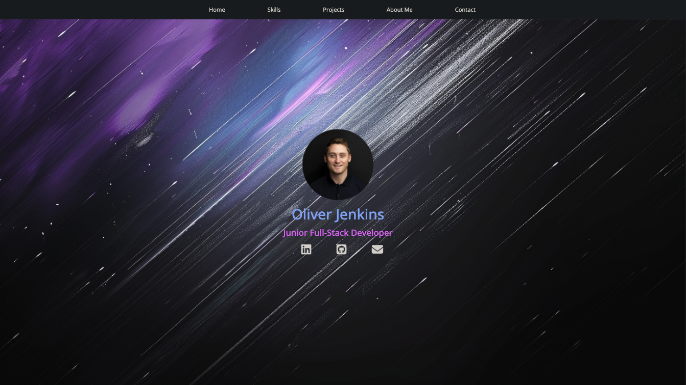

# Portfolio Project

## Project Overview
This is my personal portfolio website, designed to showcase my skills and projects as a junior software developer. The site features a responsive design, applying best practices in HTML, CSS, and JavaScript.

## Deployment Link
This project is deployed and can be viewed [here](https://cyberforge1.github.io/portfolio-project/).

## Screenshot

## Table of Contents
- [Goals & MVP](#goals--MVP)
- [Tech Stack](#tech-stack)
- [Build Steps](#build-steps)
- [Design Goals](#design-goals)
- [Project Features](#project-features)
- [Additions & Improvements](#additions--improvements)
- [Learning Highlights](#learning-highlights)

## Goals & MVP
- To build a functional and visually appealing portfolio website.Practice and showcase skills in using Git, GitHub flow, SCSS, and BEM.

## Tech Stack
- HTML
- CSS
- JavaScript
- Git

## How to use
Visit the live deployment link to explore my portfolio. The website is organized into different sections including About Me, Tech Stack, Projects, and Contact.

## Design Goals
- Decisions about project design

## Project Features
- [x] Includes basic functional requirements such as a landing page, about section, tech stack display, projects, and contact information.
- [x] Utilizes SCSS and BEM for styling; responsive design achieved using CSS Grid and Flexbox.
- [x] JavaScript is employed to enhance interactivity and manage DOM elements.

## Additions & Improvements
- [ ] Adding an email modal to the FA email icon on activation
- [ ] Addition of new and most recent projects 
- [ ] Styling of the mobile NavBar section
- [ ] Addition of a JavaScript game to interactively demonstrate skills with skill cards.

## Learning Highlights
- This project was a valuable opportunity to apply my knowledge in front-end development and to improve my proficiency with version control using Git.

## Contact Me
- Visit my [LinkedIn](https://www.linkedin.com/in/obj809/) for more details.
- Check out my [GitHub](https://github.com/cyberforge1) for more projects.
- Or send me an email at obj809@gmail.com
 
Thanks for your interest in this project. Feel free to reach out with any thoughts or questions.
 
 
Oliver Jenkins © 2024

